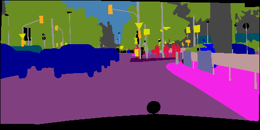

Barbara Zhan  bz2310
Pooja Kathail   pk2485
Howon Byun   hb2458

## Sources
[Photographic Image Synthesis with Cascaded Refinement Networks](http://cqf.io/ImageSynthesis/)

[Image-to-Image Translation with Conditional Adversarial Networks/Pix2Pix](https://arxiv.org/pdf/1611.07004v1.pdf)

[Pix2Pix Tensorflow Implementation](https://github.com/affinelayer/pix2pix-tensorflow)

## Result
For milestone 1, we focused mostly on getting both Cascading Refinement Networks(CRN) and Pix2Pix to work. Pix2Pix seemed to behave fine out of the box but CRN had a lot of issues, including but not limited to:
1. Lack of documentation.
2. Incorrect naming schemes/output structure.
3. Inconsistent/incorrect code among the nets for each of the target resolutions.
4. General non-Pythonic code style.
5. Undocumented interlop with Matlab code used for image processing.

Once we managed to clean up the code, we attached TensorBoard and started training the model.
There was an issue where the GPU we are using (1080Ti) could not fit the larger resolution networks in memory so for the sake of the milestone submission we trained the lowest resolution (256 x 512) network. Here are some of the images so far.

