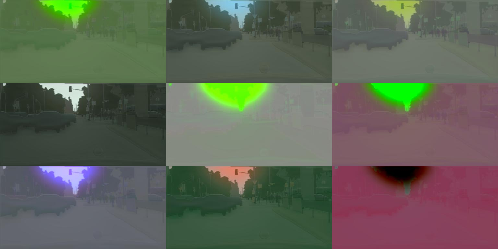
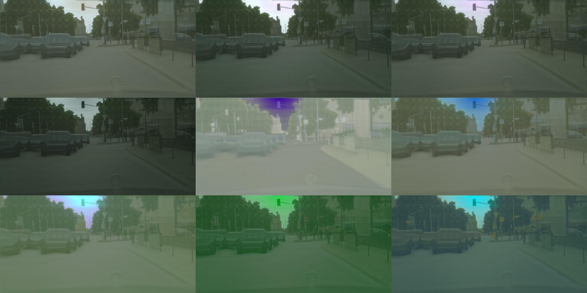
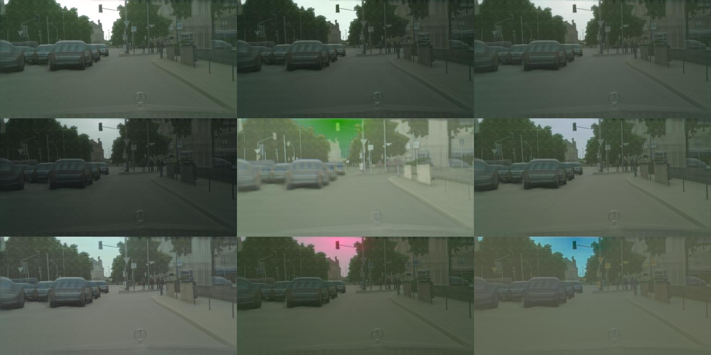

## Contributors
Barbara Zhan  bz2310 <br>
Pooja Kathail   pk2485 <br>
Howon Byun   hb2458

## Instruction
First run
```
python download_models.py
```
to download VGG weights used for loss calculation in Cascaded Refinement Network.
Goal of this project is to remove this dependency and replace it with the discriminator from Pix2Pix.

Then, two datasets from [Cityscapes](https://www.cityscapes-dataset.com/) need to be downloaded.
1. gtFine_trainvaltest.zip, which holds semantic labels that are used as the training inputs.
2. leftImg8bit_trainvaltest.zip used as training targets.

Once these are downloaded and unzipped in this directory, run resize.m by doing
```
cat resize.m| matlab -nodesktop -nosplash
```
This Matlab script will resize images in training and validations directories from both gtFine and leftImg8bit
folders into data/cityscapes/semantics and data/cityscapes/images, respectively.

Once this is done, simply perform
```
python crn.py
```

## Citations
[Photographic Image Synthesis with Cascaded Refinement Networks](http://cqf.io/ImageSynthesis/)

[Image-to-Image Translation with Conditional Adversarial Networks/Pix2Pix](https://arxiv.org/pdf/1611.07004v1.pdf)

[Pix2Pix Tensorflow Implementation](https://github.com/affinelayer/pix2pix-tensorflow)


## Result
For milestone 1, we focused mostly on getting both Cascading Refinement Networks(CRN) and Pix2Pix to work. Pix2Pix seemed to behave fine out of the box but CRN had a lot of issues, including but not limited to:
1. Lack of documentation.
2. Incorrect naming schemes/output structure.
3. Inconsistent/incorrect code among the nets for each of the target resolutions.
4. General non-Pythonic code style.
5. Undocumented interlop with Matlab code used for image processing.

Once we managed to clean up the code, we attached TensorBoard and started training the model.
There was an issue where the GPU we are using (1080Ti) could not fit the larger resolution networks in memory so for the sake of the milestone submission we trained the lowest resolution (256 x 512) network. 
Here are some of the images so far. Notice that since the original CRN used diversity loss to compute
the minimum variation across variadic output channels, each image consists of 9 panels.

Semantics <br>


Epoch 20 <br>


Epoch 50 <br>


Epoch 76 (3.5 hours) <br>

